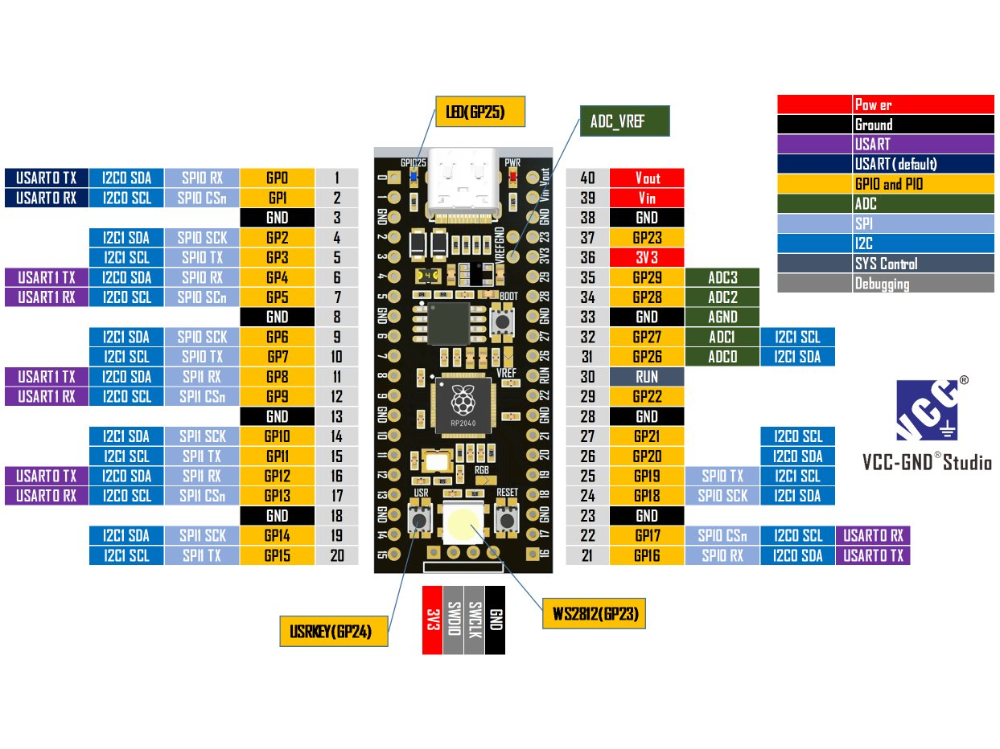
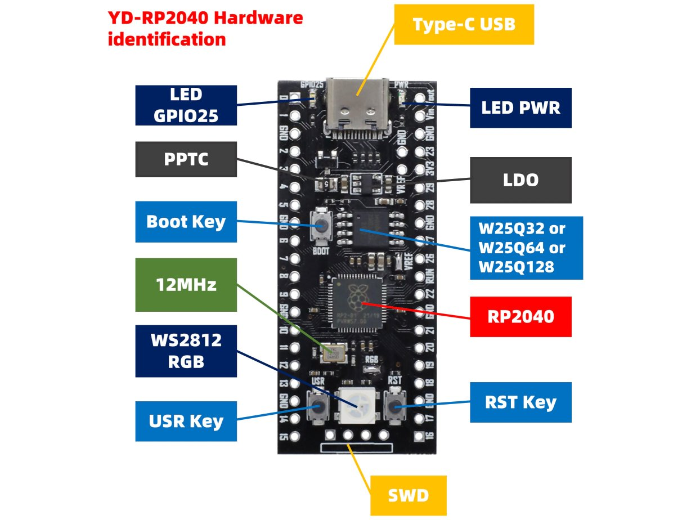

# YD-RP2040 WS2812B LED Driver (Arduino / PlatformIO)

This project controls the onboard WS2812B (NeoPixel) LED of the **YD-RP2040** board using the Arduino framework under PlatformIO.  
The LED logic is encapsulated in a custom C++ driver located in `lib/NeoPixelDriver`.

## ✦ Features

- Arduino (earlephilhower core) on RP2040 (YD-RP2040)
- Controls the built-in WS2812B LED (no wiring required)
- Adafruit NeoPixel library integration
- Clean C++ wrapper for LED control
- CMSIS-DAP support for flashing and debugging
- USB serial output via TinyUSB
- PlatformIO project structure
- Compatible with 16MB flash layout (1MB sketch, 15MB filesystem)

## ✦ YD-RP2040 Pinout and Hardware Overview

The following diagrams provide a detailed overview of the **YD-RP2040** board, which is based on the Raspberry Pi RP2040 microcontroller.

This board includes:
- A WS2812B RGB LED connected to **GPIO 23**
- A user-programmable button (USR key on GPIO 24)
- An onboard status LED (GPIO 25)
- 16 MB of flash memory (W25Q series)
- A Type-C USB connector
- Full SWD header for CMSIS-DAP debugging

### ✦ Pinout Diagram

### ✦ Hardware Identification Overview

These features make the YD-RP2040 a versatile board for embedded projects requiring RGB feedback, user input, and USB communication—all natively supported in this project.
